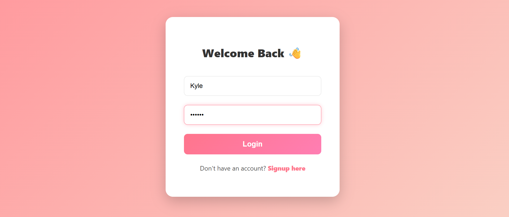
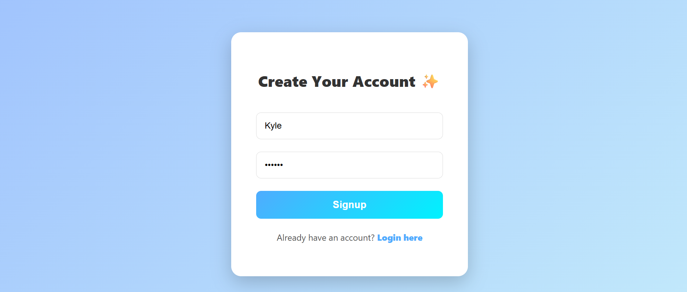
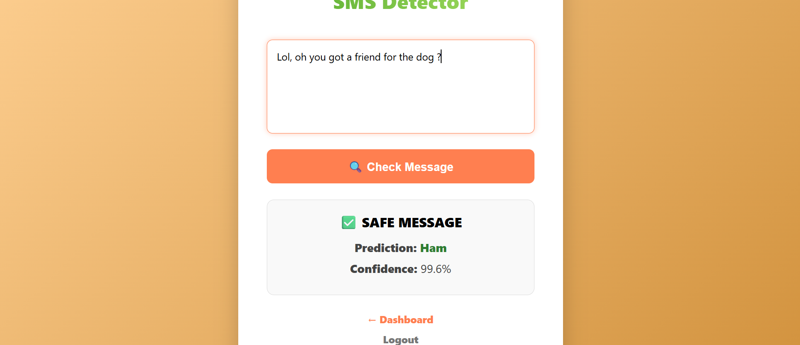
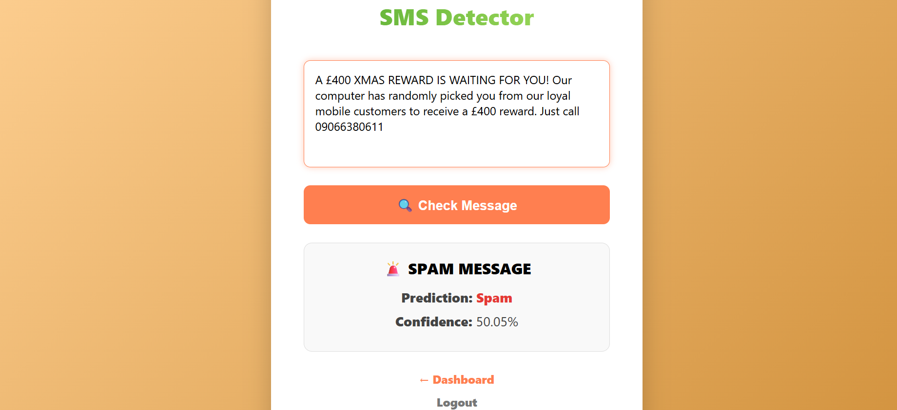
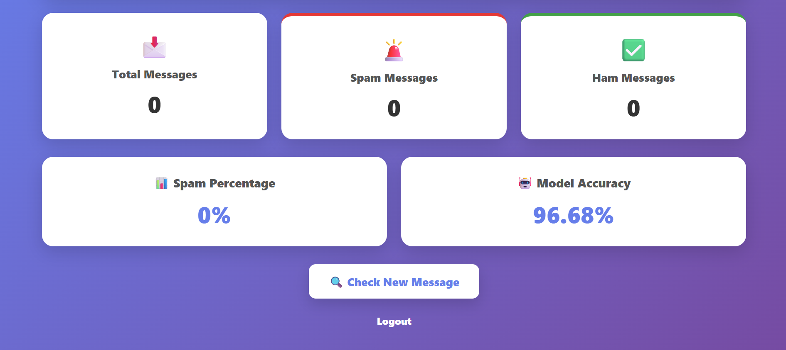

# 🛡️ Spam Detection System

A web-based **SMS Spam Detection System** that uses Machine Learning to classify messages as **Spam** or **Ham (Not Spam)**.

The application provides a simple user interface for checking SMS messages and a dashboard with message statistics and model performance.

## ✨ Features

- 🔐 User Login and Signup
- 📩 SMS spam detection
- 🚨 Spam / Ham classification
- 📊 Confidence score for predictions
- 📈 Dashboard with message statistics
- 🤖 Model accuracy display
- 🔎 Easy-to-use message checking interface
- 🎨 Clean and responsive web interface


## 🧠 How It Works

1. The user logs into the application.
2. A message is entered into the SMS Detector.
3. The trained Machine Learning model processes the message.
4. The system predicts whether the message is **Spam** or **Ham**.
5. A confidence score is displayed with the prediction.
6. The dashboard keeps track of message statistics.

## 📊 Model Performance

The current dashboard reports a model accuracy of **96.68%**.

> Accuracy shown here is based on the model currently integrated into this project.

## 🛠️ Tech Stack

- **Python**
- **Flask**
- **HTML5**
- **CSS3**
- **JavaScript**
- **Machine Learning**
- **Git & GitHub**

## 📂 Project Structure

```text
SpamDetectionSystem/
│
├── app.py
├── templates/
│   ├── index.html
│   └── dashboard.html
├── static/
│   ├── style.css
│   └── script.js
├── screenshots/
│   ├── login.png
│   ├── dashboard.png
│   ├── detector.png
│   └── spam-result.png
└── README.md
```

## ⚙️ How to Run Locally

### 1. Clone the repository

```bash
git clone https://github.com/Anujkumarr45/SpamDetectionSystem.git
cd SpamDetectionSystem
```

### 2. Create and activate a virtual environment

Windows:

```bash
python -m venv venv
venv\Scripts\activate
```

### 3. Install dependencies

```bash
pip install -r requirements.txt
```

### 4. Run the application

```bash
python app.py
```

Then open the local address shown by Flask in your browser.

## 🔮 Future Improvements

- 📱 Improve mobile responsiveness
- 📊 Add more detailed analytics
- 🧠 Experiment with different Machine Learning models
- 🗂️ Add message history and filtering
- ☁️ Deploy the application online

## 👨‍💻 Author

**Anuj Kumar**

GitHub: [@Anujkumarr45](https://github.com/Anujkumarr45)

---

⭐ If you find this project useful, consider giving it a star!


## 📸 Screenshots

### 🔐 Login Page


### 📝 Signup Page


### 🔍 Spam Detector


### 🚨 Spam Result


### 📊 Dashboard



> More screenshots will be added as the project is updated.